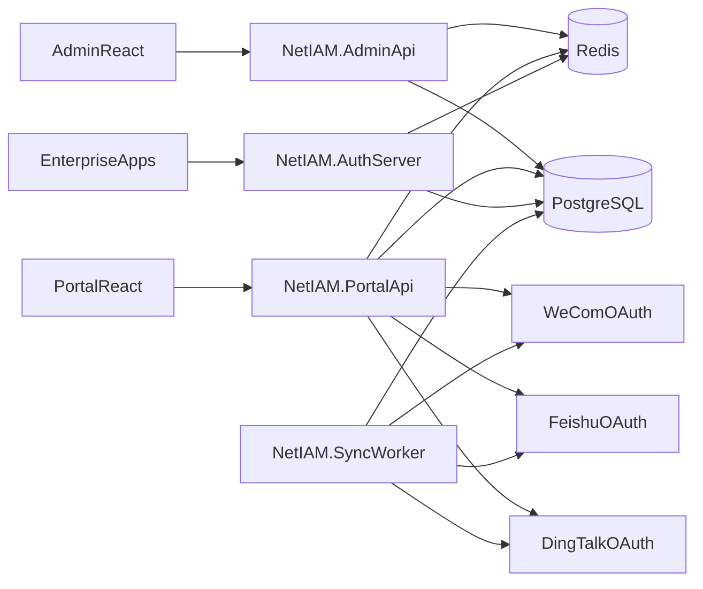

# NetIAM Architecture

## High-level Topology

## Core Services

- `NetIAM.AuthServer`
  - OpenIddict server endpoints (`/connect/authorize`, `/connect/token`, `/connect/introspect`, `/connect/userinfo`)
  - local account login endpoint (`/api/auth/local-login`)
  - OIDC client bootstrap endpoint (`/api/bootstrap/oidc/clients`)
- `NetIAM.AdminApi`
  - user/organization/tenant/provider/source/app/audit admin APIs
  - identity source sync trigger and webhook receive endpoint
- `NetIAM.PortalApi`
  - SSO authorization entry (`/authn/{provider}/{code}`)
  - callback processing (`/login/{provider}/{code}`)
  - existing account binding (`/login/bind`)
- `NetIAM.SyncWorker`
  - periodic pull sync from configured identity sources
  - sync history and records persistence

## Domain Mapping (from eiam)

- `IdentityProviderEntity` and `IdentitySourceEntity` are separated
- `ThirdPartyUserEntity` + `UserIdpBindEntity` keeps external login mapping
- `NetIamIdentityUser.ExternalId` enables auto-bind strategy
- `IdentitySourceSyncHistoryEntity` + `IdentitySourceSyncRecordEntity` stores synchronization audit trail
- `AuditEventEntity` records key authentication/admin/sync events

## Security & Observability

- password policy and lockout configured by ASP.NET Core Identity
- data protection keys persisted in Redis for multi-node consistency
- request limiting added by fixed-window rate limiter
- Serilog structured logs enabled on all backend services
